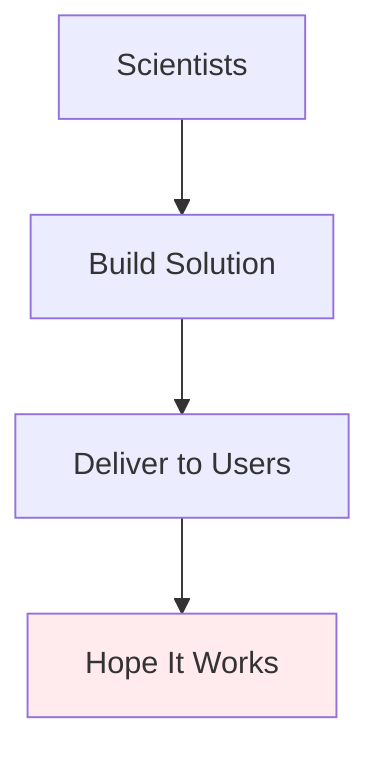
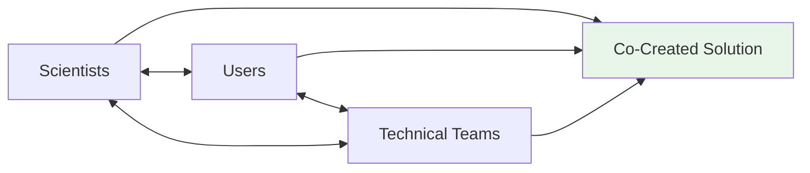

# 🤝 Co-Design Toolkit
## *Building Earth Observation Solutions Together*

> **A collaborative framework for developing user-centered Earth observation solutions through meaningful partnerships between NASA scientists, technical teams, and agency end users.**

---

## 🌟 What Makes This Different?

<table>
<tr>
<td width="50%">

### 🔄 **Traditional Approach**


</td>
<td width="50%">

### ✨ **Co-Design Approach**


</td>
</tr>
</table>

---

## 🎯 Quick Start Navigator

<details>
<summary><strong>🆕 New to Co-Design? Start Here!</strong></summary>

### Your 3-Step Journey

1. **🔍 [Understand the Framework](framework-overview.md)** - *5 min read*
   - What is co-design and why it matters
   - Core principles and mindset shifts

2. **📋 [Explore Tool Categories](tool-categories.md)** - *3 min read*
   - Browse tools by project phase
   - Find what fits your current needs

3. **🚀 [Try Your First Tool](implementation-manual.md)** - *10 min setup*
   - Step-by-step instructions
   - Tips for success

</details>

<details>
<summary><strong>⚡ Experienced User? Jump Right In!</strong></summary>

- 🔍 **[Browse All Tools](https://github.com/your-repo/issues?q=is%3Aissue+label%3Atool)** 
- 📊 **[Phase-Specific Tools](tool-categories.md#by-phase)**
- 🎯 **[Method Quick Reference](method-reference.md)**
- 📚 **[Learning Resources](learning-resources.md)**

</details>

---

## 🛠️ Tool Categories Overview

<div align="center">

| 🔍 **Discovery** | 🎨 **Co-Creation** | ⚙️ **Development** | 🚀 **Deployment** |
|:---:|:---:|:---:|:---:|
| Stakeholder Mapping | Workshop Facilitation | User Testing | Training Design |
| Needs Assessment | Requirements Definition | Prototype Iteration | Adoption Planning |
| Context Analysis | Journey Mapping | Usability Validation | Sustainability Strategy |
| [*View All →*](tool-categories.md#discovery) | [*View All →*](tool-categories.md#co-creation) | [*View All →*](tool-categories.md#development) | [*View All →*](tool-categories.md#deployment) |

</div>

---

## 📖 Documentation Structure

```
📁 This Toolkit Contains:
├── 🗺️  framework-overview.md      → The big picture and philosophy
├── 🛠️  tool-categories.md         → Organized by type and phase
├── 📋  implementation-manual.md   → Practical how-to instructions
├── 🎯  method-reference.md        → Quick lookup for specific methods
├── 📚  learning-resources.md      → Deepen your knowledge
├── 🤝  collaboration-companion.md → Working effectively with users
└── 📞  support-contact.md         → Get help when you need it
```

---

## 🎯 Success Stories

> *"The stakeholder mapping tool completely changed how we approached our wildfire monitoring solution. Instead of building what we thought users needed, we discovered what they actually needed."*
> 
> **— Solution Team Lead, Earth Science Division**

> *"Co-design workshops helped us identify critical workflow gaps we never would have found through surveys alone."*
> 
> **— Agency Partner, NOAA**

---

## 🚀 Getting Started Today

### Option 1: Browse Tools by Issue Labels
- [`🔍 discovery-tools`](https://github.com/your-repo/issues?q=is%3Aissue+label%3Adiscovery-tools) - Understanding user needs
- [`🎨 co-creation-tools`](https://github.com/your-repo/issues?q=is%3Aissue+label%3Aco-creation-tools) - Building together
- [`⚙️ development-tools`](https://github.com/your-repo/issues?q=is%3Aissue+label%3Adevelopment-tools) - Iterative improvement
- [`🚀 deployment-tools`](https://github.com/your-repo/issues?q=is%3Aissue+label%3Adeployment-tools) - Sustainable adoption

### Option 2: Use Our Tool Finder
[**🎯 Interactive Tool Finder →**](https://your-github-pages-url.github.io)

### Option 3: Start with Fundamentals
[**📖 Framework Overview →**](framework-overview.md)

---

## 🤝 Community & Contributions

This toolkit grows stronger through community contributions:

- **🐛 Report Issues**: Found a problem? [Let us know!](https://github.com/your-repo/issues/new/choose)
- **💡 Suggest Tools**: Have a method that works? [Share it!](https://github.com/your-repo/issues/new?template=new-tool.md)
- **📝 Improve Documentation**: See something unclear? [Submit a PR!](https://github.com/your-repo/pulls)
- **💬 Join Discussions**: [Ask questions, share experiences](https://github.com/your-repo/discussions)

---

## 📞 Need Help?

<div align="center">

| 🎯 **Quick Questions** | 🛠️ **Technical Issues** | 📚 **Training Requests** |
|:---:|:---:|:---:|
| [GitHub Discussions](https://github.com/your-repo/discussions) | [Issue Tracker](https://github.com/your-repo/issues) | [Contact GSFC Support](support-contact.md) |

</div>

---

## 📄 Attribution & Sources

This toolkit synthesizes best practices from:

- **NASA NSITE** (NASA Satellite Needs Working Group Implementation Team)
- **SERVIR** (NASA and USAID joint program) Service Planning Toolkit
- **MSFC** (Marshall Space Flight Center) Solution Co-Development Initiative
- **GSFC** Earth Science Division Co-Design Programs

*Full source documentation and citations available in each tool.*

---

<div align="center">

**🌍 Building better Earth observation solutions, together.**

[](https://github.com/your-repo/issues)
[](https://github.com/your-repo/graphs/contributors)
[](https://github.com/your-repo/commits/main)

</div>
