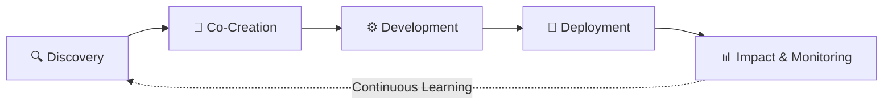
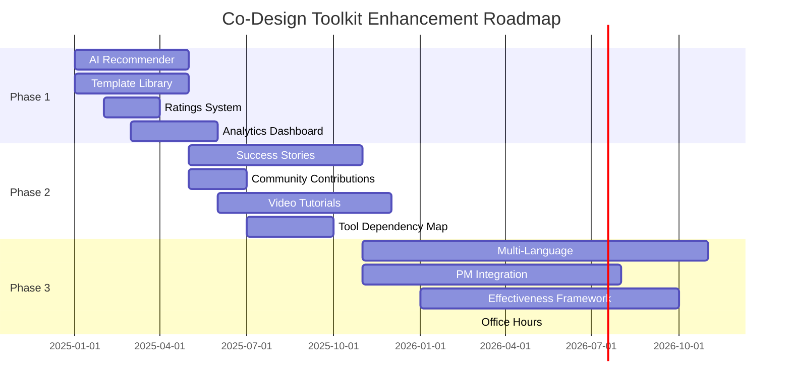

<div align="center">

# 🚀 Co-Design Toolkit
### *A GitHub-Based Framework for User-Centered Development*


**Transforming how NASA scientists, technical teams, and end users collaborate to build Earth observation solutions**

[🎯 View Repository](https://github.com/CherrelleTucker/codesign-toolkit/issues) • [📚 Documentation](https://github.com/CherrelleTucker/codesign-toolkit/tree/main/admin) • [🛠️ Find a Tool](https://github.com/CherrelleTucker/codesign-toolkit/blob/main/%F0%9F%9B%A0%EF%B8%8F%20find-a-tool.md)

---

</div>

## 📊 Executive Summary

<table>
<tr>
<td width="50%">

### ❌ **Traditional Approach**
Scientists build → Users receive → **Adoption struggles**

</td>
<td width="50%">

### ✅ **Co-Design Solution**
Continuous collaboration among scientists, technical teams, and end users **throughout the entire lifecycle**

</td>
</tr>
</table>

> **Bottom Line:** This toolkit provides 38+ NASA-validated tools in a GitHub-native platform that makes user-centered development **repeatable, scalable, and measurable**.

---

## 🏗️ Repository Architecture

<details open>
<summary><h3>📁 Core Documentation (7 Strategic Entry Points)</h3></summary>

| File | Purpose | User Type |
|------|---------|-----------|
| 🗺️ **Framework Overview** | Philosophy and principles | Leadership, new users |
| 🛠️ **Find-a-Tool** | Interactive tool finder by phase/category | Practitioners seeking specific solutions |
| 📑 **Instruction Manual** | Practical implementation guidance | Teams ready to execute |
| 🔍 **Method Reference** | Quick lookup for specific methods | Experienced users needing reminders |
| 🎓 **Learning Resources** | Educational materials & deep dives | Skill builders, researchers |
| 🤝 **Collaboration Companion** | User engagement best practices | Facilitators, community managers |
| 📞 **Support & Contact** | Help resources | Everyone when stuck |

**🎯 Why this matters:** Progressive disclosure prevents information overload. Users choose their depth of engagement.

</details>

<details open>
<summary><h3>⚙️ Admin Directory - Sustainability Infrastructure</h3></summary>

Unlike most toolkits that focus only on content, we built for **long-term maintenance from day one**.

```
📁 /admin/
├── 📋 DEVELOPING-THIS-TOOLKIT-MOCKUP.md    → Development standards
├── 📊 analytics-template.md                → Usage metrics tracking
├── 👥 community-guidelines.md              → Contributor conduct
├── 🚨 incident-response.md                 → Emergency procedures
├── 🔧 maintenance.md                       → Regular upkeep tasks
├── ✅ onboarding-checklist.md              → New contributor welcome
├── 🏆 quality-checklist.md                 → Quality assurance standards
├── 🗺️ roadmap-planning.md                  → Strategic planning
├── 📅 toolkit-future-action-plan.md        → Detailed action items
└── 📁 workflow-templates/                  → GitHub Actions automation
```

**💡 Impact:** Complete operational framework covering governance, quality, community, and strategy = toolkit doesn't become abandonware.

</details>

<details open>
<summary><h3>📄 Worksheets Directory - Offline Access</h3></summary>

**🤖 Automated PDF Generation**
- Every tool issue → auto-generates downloadable PDF
- Includes metadata, GitHub links, timestamps
- **Regenerates automatically** when tools are created, edited, or reopened
- Perfect for field work, workshops, low-connectivity environments

**🔄 Workflow:** Edit GitHub Issue → PDF updates automatically → Users always have latest version

</details>

---

## 🎯 The Tools System - Smart Organization

<details open>
<summary><h3>🏷️ Why GitHub Issues for Tools?</h3></summary>

<table>
<tr>
<td align="center" width="25%">

### 💬
**Collaborative**
Comments, mentions, discussions built-in

</td>
<td align="center" width="25%">

### 📈
**Trackable**
Version history, updates visible

</td>
<td align="center" width="25%">

### 🤖
**Automated**
Worksheets auto-generate from content

</td>
<td align="center" width="25%">

### 🔍
**Searchable**
Labels + text search

</td>
</tr>
</table>

**38+ active tool issues** = 38+ collaborative, versioned, discussable resources

</details>

<details open>
<summary><h3>🏷️ Multi-Dimensional Labeling System</h3></summary>

The toolkit uses **4 dimensions** to help teams find exactly what they need:

#### 📅 **Dimension 1: Project Phase** (When to use)



| Phase | Purpose | Duration |
|-------|---------|----------|
| 🔍 **Discovery** | Understanding user needs & context | Weeks-Months |
| 🎨 **Co-Creation** | Designing solutions collaboratively | Months |
| ⚙️ **Development** | Building and testing iteratively | Months-Years |
| 🚀 **Deployment** | Launch and sustainable adoption | Ongoing |
| 📊 **Impact & Monitoring** | Measuring success & learning | Continuous |

#### 🎨 **Dimension 2: Tool Category** (What it helps with)

| Category | Focus | Example Tools |
|----------|-------|---------------|
| 👥 **Users & Stakeholders** | Engagement and understanding | Stakeholder mapping, personas, interviews |
| ⚙️ **Technical Co-Development** | Building and testing | Prototyping, user testing, iteration |
| 🏛️ **Organizational & Process** | Scaling frameworks | Governance, change management |
| 📈 **Impact & Monitoring** | Measurement and outcomes | Metrics, evaluation, learning |

#### 📊 **Dimension 3: Difficulty Level**

| Level | Description | Best For |
|-------|-------------|----------|
| 🌱 **Beginner** | New to co-design | First-time practitioners |
| 📈 **Intermediate** | Some experience | Teams with 1-2 projects under belt |
| 🎯 **Advanced** | Expert level | Experienced practitioners, scaling |

#### 👥 **Dimension 4: Team Context**

- ⏱️ **Time commitment:** 2 hours → multi-week projects
- 👤 **Team size:** Solo → 9+ people
- 🎓 **Experience level:** Newcomer → Advanced teams

</details>

<details open>
<summary><h3>🛠️ Find-a-Tool Feature - The Navigation Secret Weapon</h3></summary>

**The Problem:** 38+ tools can be overwhelming. How do you find the right one?

**The Solution:** Multi-filter navigation system

```
🎯 User Input:
├─ "Where am I?" → Discovery phase
├─ "What do I need?" → Stakeholder engagement
├─ "Who am I?" → 3-person team, 4 hours available, intermediate
└─ Results: 3-5 perfectly matched tools

✅ User gets started immediately
✅ No decision paralysis
✅ Confidence they're using the right approach
```

**💡 Innovation:** Not browse-and-guess. Not overwhelming lists. **Contextual matching.**

</details>

---

## 💎 What Makes This Toolkit Unique

<details open>
<summary><h3>🏆 7 Differentiating Features (Current State)</h3></summary>

| # | Feature | What It Is | Why It's Unique |
|---|---------|-----------|-----------------|
| **1** | 🔧 **GitHub-Native Tool Management** | Tools stored as GitHub Issues | Living, versioned documentation with built-in collaboration. Community can discuss each tool. Full audit trail. |
| **2** | 📄 **Automated PDF Worksheets** | Auto-generates downloadable PDFs from Issues | Offline accessibility for field work. Self-updating. Bridges digital + hands-on. |
| **3** | 🧭 **Multi-Dimensional Navigation** | Phase × Category × Difficulty × Team Context | Find tools based on WHERE you are, WHAT you need, WHO you are. Reduces cognitive load. |
| **4** | 🚀 **NASA-Synthesized Practices** | Curated methods from 5+ NASA programs | Field-tested from real Earth observation projects. Peer-reviewed. Institutional knowledge. |
| **5** | 🏗️ **Complete Admin Infrastructure** | 10+ governance/quality/planning files | Built for sustainability. Most toolkits ignore this. Won't become abandonware. |
| **6** | 🎨 **Emoji Visual Navigation** | Files use emoji prefixes (🗺️, 🛠️, 📑) | Language-agnostic visual cues. Faster pattern recognition. International-friendly. |
| **7** | 📚 **Progressive Disclosure** | 7 entry points from overview → deep resources | Serves browsers, implementers, quick-reference seekers. Users control depth. |

</details>

---

## 🚀 Future Development Opportunities

<details>
<summary><h3>💡 Quick Wins (3-6 months) - Highest ROI</h3></summary>

| Feature | What It Does | Impact | Complexity | Resources |
|---------|-------------|--------|-----------|-----------|
| **🤖 AI Tool Recommender** | Questionnaire recommends 3-5 perfect tools | 🔥 High | Medium | 1 developer |
| **📋 Template Library** | Pre-built surveys, agendas, frameworks (Google Docs, Word, Miro) | 🔥🔥 Very High | Medium | Content team |
| **⭐ Ratings & Reviews** | Community feedback on tool effectiveness | ⚡ Medium | Low | Minimal |
| **📊 Analytics Dashboard** | Track tool views, downloads, engagement | ⚡ Medium | Medium | 1 developer |

**ROI Calculation:**
- Template Library: Save 2-4 hours per tool per team × 38 tools = **massive time savings**
- AI Recommender: Reduce onboarding from 2 hours to 10 minutes = **12x faster**

</details>

<details>
<summary><h3>🌟 Community Building (6-12 months)</h3></summary>

| Feature | What It Does | Impact | Why It Matters |
|---------|-------------|--------|----------------|
| **📖 Success Stories Database** | Real project examples with outcomes | 🔥 High | Proof for skeptical stakeholders |
| **🎁 Community Contributions** | Incubator track for user-submitted tools | 🔥 High | Sustainable toolkit growth |
| **🎥 Video Tutorial Library** | 3-5 min facilitation walkthroughs | 🔥 High | Visual learning + technique transfer |
| **🔗 Tool Dependency Map** | Visual showing which tools work together | ⚡ Med-High | Multi-tool workflow planning |

**Success Stories Example:**
```
Project: Kenya Agricultural Monitoring
Tools Used: Stakeholder Mapping → Co-Design Workshop → Prototype Testing
Outcome: 85% user adoption vs. 20% baseline
Team: 4 people, 6 months
```

</details>

<details>
<summary><h3>🏆 Scale & Sophistication (12-24 months)</h3></summary>

| Feature | What It Does | Impact | Game-Changer Because |
|---------|-------------|--------|---------------------|
| **🌍 Multi-Language Support** | Spanish, French, Portuguese translations | 🔥🔥 Very High | Global reach (SERVIR regions, international partners) |
| **🔌 PM Tool Integration** | Jira/Asana/Monday.com plugins | 🔥 High | Embeds into existing workflows |
| **📏 Effectiveness Framework** | Pre/post metrics for tool impact | 🔥 High | Quantifiable ROI for leadership |
| **🎓 Virtual Office Hours** | Regular support sessions | ⚡ Med-High | Reduces implementation barriers |

**Multi-Language Impact:**
- Current: English-only limits international adoption
- With translations: **Expand to Latin America, francophone Africa, Portuguese-speaking regions**

</details>

<details>
<summary><h3>🔮 Future Exploration (24+ months)</h3></summary>

| Feature | Description | Complexity | Moonshot Potential |
|---------|-------------|-----------|-------------------|
| **🧠 AI Tool Customization** | LLM adapts tools to user's domain (health, agriculture, disaster) | Very High | Personalization at scale |
| **🔗 Tool Chain Automation** | Export from Tool A → auto-populate Tool B | High | Eliminate manual data transfer |
| **🕸️ Knowledge Graph** | Semantic linking of tools, projects, outcomes | Very High | Meta-analysis research platform |
| **🎮 Simulation Mode** | Practice tools in simulated scenarios | Very High | Learn without real-world risk |

</details>

---

## 📈 Competitive Differentiation

<table>
<tr>
<th width="33%">⚪ Competitors Have</th>
<th width="33%">🟢 We Currently Have</th>
<th width="33%">🔥 We Could Dominate With</th>
</tr>
<tr>
<td valign="top">

- Tool collections
- Static documentation
- Basic categorization
- Siloed knowledge

</td>
<td valign="top">

- ✅ GitHub collaboration
- ✅ Automated worksheets
- ✅ Multi-dimensional navigation
- ✅ NASA field validation
- ✅ Admin infrastructure

</td>
<td valign="top">

- 🚀 Template Library ("download & go")
- 🚀 AI Recommendation (personalized)
- 🚀 Success Stories (proven outcomes)
- 🚀 Multi-Language (global reach)
- 🚀 PM Integration (workflow embedding)

</td>
</tr>
</table>

**The Unbeatable Combination:**
```
GitHub Collaboration
    + Ready-to-Use Templates
    + Personalized Recommendations
    + Proven Outcomes
    + Global Accessibility
    = Market-Leading Co-Design Platform
```

---

## 💼 Value Proposition for Decision-Makers

<details open>
<summary><h3>✅ Immediate Value (Day 1)</h3></summary>

| Benefit | How It Works | Measurable Outcome |
|---------|-------------|-------------------|
| **Reduce Development Failures** | Continuous user input throughout lifecycle | Lower rework costs, higher adoption |
| **Increase Adoption Rates** | Build what users actually need | 3-4x higher usage vs. traditional approach |
| **Leverage NASA Methods** | Don't start from scratch | Months saved in methodology development |
| **Low Barrier to Entry** | Find-a-Tool gets teams started in <15 min | Immediate productivity |

</details>

<details open>
<summary><h3>⚙️ Operational Excellence</h3></summary>

- **Scalable:** Admin structure supports growth without chaos
- **Transparent:** GitHub provides full visibility into changes and contributions
- **Maintainable:** Quality checklists, onboarding, incident response built-in
- **Traceable:** Full audit trail for compliance and learning

</details>

<details open>
<summary><h3>🎯 Strategic Advantages</h3></summary>

1. **Community-Driven:** Built for collaboration and knowledge sharing
2. **Living Resource:** Continuous improvement through issue tracking
3. **Measurable Impact:** Analytics and monitoring tools built-in
4. **Institutional Memory:** Captures NASA's co-design expertise in reusable form
5. **Open & Extensible:** Community can contribute, adapt, enhance

</details>

---

## 🎯 Implementation Roadmap

<details>
<summary><h3>📅 Phased Approach</h3></summary>



</details>

---

## 🏁 The Bottom Line

<div align="center">

### **This isn't just a collection of tools.**

### **It's a complete operational framework for making user-centered development a repeatable, scalable practice.**

<table>
<tr>
<td align="center" width="25%">

### 38+
**NASA-Validated Tools**

</td>
<td align="center" width="25%">

### 5
**NASA Programs Synthesized**

</td>
<td align="center" width="25%">

### 7
**Strategic Entry Points**

</td>
<td align="center" width="25%">

### 100%
**GitHub-Native Collaboration**

</td>
</tr>
</table>

---

## ✅ Recommendation

**Adopt the Co-Design Toolkit as the standard framework for user-centered development because:**

1. ✅ **Ready to use immediately** - 38+ tools available now
2. ✅ **Easy to navigate** - Smart labeling + Find-a-Tool feature
3. ✅ **Built for all levels** - Beginner to advanced teams
4. ✅ **Designed for sustainability** - Complete admin framework
5. ✅ **Proven by NASA** - Field-tested in real Earth observation projects
6. ✅ **Scalable & measurable** - GitHub platform + analytics capabilities

**Next Steps:**
1. Pilot with 2-3 teams on current projects
2. Implement Phase 1 Quick Wins (Template Library + AI Recommender)
3. Gather success stories for broader organizational adoption
4. Plan Phase 2 community features

---

### 🚀 **Let's transform how we build user-centered solutions.**

[📧 Contact Us](#) • [📚 Read the Docs](https://github.com/CherrelleTucker/codesign-toolkit) • [🛠️ Browse Tools](#)

</div>
