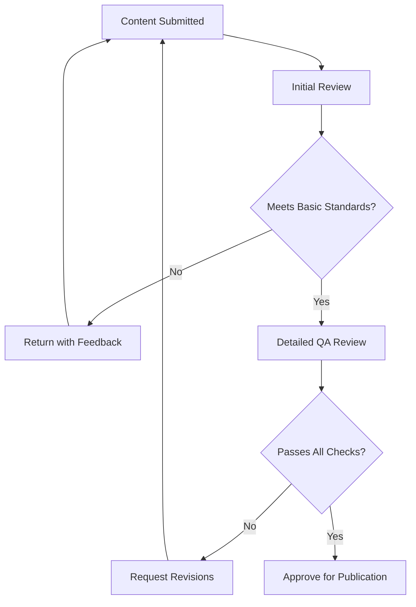

# ✅ Quality Checklist
## *Standardized QA Templates for Co-Design Toolkit Content*

**Document Purpose**: Comprehensive quality assurance checklists and templates for maintaining consistent, high-quality toolkit content

**Target Audience**: Maintainers, reviewers, content contributors

**Usage**: Reference during content review, tool development, and quality audits

**Last Updated**: [Current Date] | **Version**: 1.0

---

## 📋 Master Quality Standards

### **Core Quality Principles**
Every piece of toolkit content must meet these fundamental standards:

| **Principle** | **Standard** | **Verification Method** |
|---------------|--------------|-------------------------|
| **🔬 Evidence-Based** | All tools grounded in authoritative sources | Source citation verification |
| **👥 User-Centered** | Designed for practitioner success | User experience review |
| **♿ Accessible** | Usable by diverse audiences and abilities | Accessibility audit |
| **🔗 Integrated** | Connects meaningfully with other tools | Integration verification |
| **📊 Actionable** | Users can implement without additional research | Completeness assessment |

### **Quality Assurance Workflow**


---

## 🔍 New Tool Review Checklist

### **Pre-Review Assessment**

<details>
<summary><strong>📋 Initial Evaluation (5 minutes)</strong></summary>

**Tool Submission Information:**
- [ ] **Tool Name**: Clear, action-oriented, descriptive
- [ ] **Category Assignment**: Appropriate category selection (Users & Stakeholders, Technical Co-Development, Organizational & Process, Impact & Monitoring)
- [ ] **Difficulty Level**: Realistic assessment (🌱 Beginner, 📈 Intermediate, 🎯 Advanced)
- [ ] **Time Estimate**: Reasonable time requirement for target users
- [ ] **Prerequisites**: Clear identification of required prior knowledge or resources

**Quick Standards Check:**
- [ ] **Template Compliance**: Uses standard tool template structure
- [ ] **Length Appropriateness**: Substantial enough to be useful, not overwhelming
- [ ] **Visual Organization**: Good use of headings, tables, lists, collapsible sections
- [ ] **Complete Submission**: All sections present, no obvious gaps

**Decision Point**: 
- ✅ **Proceed to Full Review**: Tool meets basic standards
- ❌ **Return for Revision**: Major issues require correction before review

</details>

### **Content Quality Assessment**

<details>
<summary><strong>📖 Detailed Content Review (20-30 minutes)</strong></summary>

#### **Evidence-Based Standards**
- [ ] **Source Attribution**: All sources properly cited with complete information
- [ ] **Methodology Validation**: Tool approach grounded in proven co-design methodologies
- [ ] **Authority Verification**: Sources are authoritative (NASA, SERVIR, academic literature, established frameworks)
- [ ] **Currency Check**: Sources are current and references active

**Source Quality Checklist:**
```markdown
For each source cited:
- [ ] Full citation provided (author, title, date, organization)
- [ ] Source is authoritative and credible
- [ ] Content accurately reflects source material
- [ ] Link functional (if applicable)
- [ ] Attribution follows toolkit standards
```

#### **User-Centered Design Assessment**
- [ ] **Clear Purpose**: Tool purpose and value proposition clearly stated
- [ ] **Target User Identification**: Specific user types and contexts identified
- [ ] **Actionable Instructions**: Users can implement without additional research
- [ ] **Realistic Expectations**: Time estimates and difficulty levels accurate
- [ ] **Success Criteria**: Clear indicators of successful tool application

#### **Content Completeness**
- [ ] **Tool Summary Card**: Complete with all required fields
- [ ] **When to Use Section**: Clear guidance on appropriate application
- [ ] **Main Content**: Comprehensive coverage of tool methodology
- [ ] **Integration Section**: Connections to other tools documented
- [ ] **Community Discussion**: Prompts for user engagement included

</details>

### **Technical Quality Review**

<details>
<summary><strong>⚙️ Technical Standards Check (10-15 minutes)</strong></summary>

#### **Formatting and Structure**
- [ ] **Markdown Compliance**: Proper markdown syntax throughout
- [ ] **Code Formatting**: 4-space indentation used to prevent escaping
- [ ] **Heading Hierarchy**: Logical H1, H2, H3 structure
- [ ] **Collapsible Sections**: Long content appropriately organized
- [ ] **Table Formatting**: Proper table structure with headers

#### **Link Validation**
- [ ] **Internal Links**: All references to other tools functional
- [ ] **External Links**: All external references accessible
- [ ] **GitHub Issues**: Correct issue numbers for related tools
- [ ] **Anchor Links**: Internal page navigation working

#### **Visual Design**
- [ ] **Readability**: Appropriate line breaks, white space, visual hierarchy
- [ ] **Emoji Usage**: Consistent with toolkit style, aids navigation
- [ ] **Table Design**: Readable width, proper alignment, helpful headers
- [ ] **List Organization**: Logical grouping, appropriate list types

</details>

### **User Experience Validation**

<details>
<summary><strong>👤 Usability Assessment (15-20 minutes)</strong></summary>

#### **Accessibility Standards**
- [ ] **Screen Reader Compatibility**: Proper heading structure, alt text for images
- [ ] **Visual Accessibility**: Adequate contrast, readable fonts, scalable design
- [ ] **Cognitive Accessibility**: Clear language, logical flow, manageable information chunks
- [ ] **Motor Accessibility**: Large enough click targets, keyboard navigation friendly

#### **User Experience Flow**
- [ ] **Logical Progression**: Information presented in logical order
- [ ] **Cognitive Load**: Information chunked appropriately, not overwhelming
- [ ] **Scannable Content**: Headers, bullets, and formatting support quick reading
- [ ] **Action Clarity**: Next steps and implementation path clear

#### **Language and Tone**
- [ ] **Professional Yet Approachable**: Serious about quality, friendly in delivery
- [ ] **Inclusive Language**: Accessible to diverse users and backgrounds
- [ ] **Appropriate Level**: Language appropriate for target difficulty level
- [ ] **Active Voice**: Action-oriented, direct instructions

</details>

---

## 📝 Content Update Review Checklist

### **Update Type Assessment**

<details>
<summary><strong>📊 Update Categorization (2 minutes)</strong></summary>

**Update Classification:**
- [ ] **Minor Fix**: Typos, broken links, small clarifications
- [ ] **Content Enhancement**: Additional examples, improved explanations
- [ ] **Methodology Update**: Changes based on new source material
- [ ] **Major Revision**: Significant restructuring or new content sections

**Review Scope Determination:**
- **Minor Fix**: Quick verification, single reviewer
- **Content Enhancement**: Standard content review process
- **Methodology Update**: Full quality review including source verification
- **Major Revision**: Treat as new tool submission

</details>

### **Update Quality Standards**

<details>
<summary><strong>🔄 Change Assessment (10-20 minutes depending on scope)</strong></summary>

#### **Content Integrity**
- [ ] **Consistency Maintained**: Updates align with existing tool structure and tone
- [ ] **Accuracy Preserved**: Changes don't introduce errors or contradictions
- [ ] **Source Alignment**: Updates consistent with source material changes
- [ ] **Cross-Reference Check**: Related tools updated if necessary

#### **Improvement Validation**
- [ ] **User Value Added**: Changes improve user experience or tool effectiveness
- [ ] **Clarity Enhanced**: Updates make content clearer, not more confusing
- [ ] **Completeness Improved**: Gaps filled without creating new ones
- [ ] **Integration Maintained**: Tool still connects appropriately with others

#### **Technical Verification**
- [ ] **Format Consistency**: Updates follow toolkit formatting standards
- [ ] **Link Verification**: New or changed links functional
- [ ] **Version Control**: Changes properly documented and attributed
- [ ] **Quality Maintained**: Updates don't decrease overall tool quality

</details>

---

## 🔗 Link Validation Procedures

### **Systematic Link Auditing**

<details>
<summary><strong>🌐 Comprehensive Link Check Process</strong></summary>

#### **Monthly Link Audit** (30-45 minutes)
**Automated Check Phase:**
- [ ] **Tool Selection**: Review 20% of toolkit tools (rotate monthly)
- [ ] **Link Extraction**: Document all external and internal links
- [ ] **Automated Testing**: Use link checker tool for initial validation
- [ ] **Error Documentation**: Record all broken or problematic links

**Manual Verification Phase:**
- [ ] **Content Relevance**: Verify links still point to relevant content
- [ ] **Authority Maintenance**: Ensure sources maintain credibility
- [ ] **Access Verification**: Confirm links accessible to intended users
- [ ] **Alternative Sources**: Identify replacements for broken authoritative links

#### **Link Quality Standards**
```markdown
All links must meet these criteria:
✅ Functional: Link resolves without errors
✅ Relevant: Content directly supports tool guidance
✅ Authoritative: Source is credible and appropriate
✅ Accessible: Available to intended user audience
✅ Current: Content is up-to-date and maintained
```

#### **Link Repair Process**
1. **Document Issue**: Record broken link and context
2. **Find Alternative**: Search for updated or alternative authoritative source
3. **Verify Quality**: Ensure replacement meets quality standards
4. **Update Content**: Make link change and any necessary content adjustments
5. **Cross-Check**: Verify change doesn't affect other references
6. **Document Change**: Record repair in maintenance log

</details>

### **Emergency Link Response**

<details>
<summary><strong>🚨 Broken Link Emergency Protocol</strong></summary>

**High-Priority Link Issues** (Response within 24 hours):
- [ ] **Toolkit Navigation Links**: Broken internal navigation
- [ ] **Primary Source Materials**: Key methodology sources inaccessible
- [ ] **User-Reported Issues**: Community reports of broken critical links
- [ ] **Security Issues**: Links pointing to compromised or inappropriate content

**Response Procedure:**
1. **Immediate Assessment**: Verify issue and assess impact
2. **Temporary Fix**: Remove or comment out problematic link if necessary
3. **Permanent Solution**: Find appropriate replacement or fix
4. **Community Update**: Inform users if critical resource affected
5. **Prevention Review**: Analyze why issue occurred and prevent recurrence

</details>

---

## ♿ Accessibility Check Procedures

### **Accessibility Compliance Standards**

<details>
<summary><strong>🌐 WCAG 2.1 AA Compliance Check</strong></summary>

#### **Visual Accessibility**
- [ ] **Color Contrast**: Text meets 4.5:1 contrast ratio minimum
- [ ] **Color Independence**: Information not conveyed by color alone
- [ ] **Text Scalability**: Content readable when zoomed to 200%
- [ ] **Visual Hierarchy**: Clear heading structure and visual organization

#### **Navigation Accessibility**
- [ ] **Keyboard Navigation**: All interactive elements keyboard accessible
- [ ] **Focus Indicators**: Clear visual focus indicators for interactive elements
- [ ] **Skip Links**: Ability to skip repetitive navigation (where applicable)
- [ ] **Logical Tab Order**: Tab navigation follows logical content flow

#### **Content Accessibility**
- [ ] **Heading Structure**: Proper H1, H2, H3 hierarchy for screen readers
- [ ] **Alt Text**: Descriptive alternative text for all images and graphics
- [ ] **Link Descriptions**: Link text describes destination clearly
- [ ] **Table Headers**: Data tables include proper header markup

#### **Cognitive Accessibility**
- [ ] **Clear Language**: Plain language appropriate for education level
- [ ] **Logical Structure**: Information presented in logical order
- [ ] **Consistent Navigation**: Predictable layout and navigation patterns
- [ ] **Error Prevention**: Clear instructions prevent user errors

</details>

### **Accessibility Testing Process**

<details>
<summary><strong>🧪 Testing Methodology</strong></summary>

#### **Automated Testing** (10 minutes)
- [ ] **Screen Reader Test**: Use screen reader to navigate content
- [ ] **Keyboard Navigation Test**: Navigate using only keyboard
- [ ] **Color Contrast Check**: Use contrast analyzer tool
- [ ] **HTML Validation**: Verify proper markup structure

#### **Manual Testing** (15 minutes)
- [ ] **Content Flow Test**: Read content without visual formatting
- [ ] **Instruction Clarity Test**: Follow instructions without visual cues
- [ ] **Zoom Test**: Test readability at 200% zoom level
- [ ] **Mobile Accessibility**: Test on mobile device with accessibility features

#### **User Perspective Testing**
- [ ] **Cognitive Load Assessment**: Content manageable for target difficulty level
- [ ] **Error Recovery**: Users can recover from mistakes easily
- [ ] **Help Availability**: Assistance available when users need it
- [ ] **Success Feedback**: Users know when they've completed tasks successfully

</details>

---

## 📊 Quality Metrics and Reporting

### **Quality Score Assessment**

<details>
<summary><strong>📈 Quantitative Quality Measurement</strong></summary>

#### **Tool Quality Scorecard**
```markdown
Tool Quality Assessment: [Tool Name]
Reviewer: [Name]
Date: [Review Date]

Content Quality (40 points possible):
- Evidence-based methodology: ___/10
- Source attribution completeness: ___/10  
- User-centered design: ___/10
- Content completeness: ___/10

Technical Quality (30 points possible):
- Formatting and structure: ___/10
- Link functionality: ___/10
- Template compliance: ___/10

User Experience (30 points possible):
- Accessibility compliance: ___/10
- Clarity and usability: ___/10
- Integration and context: ___/10

Total Score: ___/100

Quality Rating:
- 90-100: Excellent (approve immediately)
- 80-89: Good (minor revisions may be suggested)
- 70-79: Acceptable (revisions recommended)
- Below 70: Needs significant improvement

Comments: [Specific feedback and recommendations]
```

</details>

### **Quality Trend Monitoring**

<details>
<summary><strong>📊 Quality Metrics Dashboard</strong></summary>

#### **Monthly Quality Report Template**
```markdown
Toolkit Quality Report: [Month Year]

Content Review Activity:
- Tools reviewed: [X]
- New tools approved: [X]
- Tools requiring revision: [X]
- Average quality score: [X.X/100]

Quality Issue Trends:
- Most common content issues: [List top 3]
- Most common technical issues: [List top 3]
- Most common accessibility issues: [List top 3]

Improvement Actions Taken:
- [Action 1]: [Description and impact]
- [Action 2]: [Description and impact]

Quality Goals for Next Month:
- [Goal 1]: [Specific target]
- [Goal 2]: [Specific target]

Reviewer Performance:
- Average review time: [X] minutes
- Inter-reviewer agreement: [X]%
- Community satisfaction with quality: [X/5]
```

</details>

---

## 🎯 Specialized Quality Checks

### **Source Attribution Verification**

<details>
<summary><strong>📚 Source Quality Assurance</strong></summary>

#### **Attribution Completeness Check**
- [ ] **Primary Sources**: All major methodology sources cited
- [ ] **Supporting Sources**: Additional references for context
- [ ] **Methodology Foundation**: Broader literature or framework sources
- [ ] **Attribution Format**: Follows toolkit attribution standards

#### **Source Authority Validation**
```markdown
For each source cited, verify:
- [ ] Authority: NASA, SERVIR, established academic/research institution
- [ ] Currency: Published within reasonable timeframe for methodology
- [ ] Relevance: Directly supports tool methodology or context
- [ ] Accessibility: Available to intended toolkit users
- [ ] Accuracy: Content accurately represents source material
```

#### **Citation Integrity Check**
- [ ] **Quote Accuracy**: All quoted material exactly matches source
- [ ] **Context Preservation**: Quoted material used in appropriate context
- [ ] **Attribution Placement**: Citations appear near referenced content
- [ ] **Link Functionality**: All source links accessible and current

</details>

### **Integration Validation**

<details>
<summary><strong>🔗 Tool Ecosystem Quality</strong></summary>

#### **Cross-Tool Connection Assessment**
- [ ] **Logical Relationships**: Integration suggestions make methodological sense
- [ ] **Accurate References**: All tool references use correct names and issue numbers
- [ ] **Reciprocal Integration**: Related tools reference each other appropriately
- [ ] **Workflow Coherence**: Tool combinations create coherent workflows

#### **User Journey Validation**
- [ ] **Prerequisites Clear**: Users know what to complete before this tool
- [ ] **Next Steps Evident**: Clear guidance on what comes after this tool
- [ ] **Alternative Paths**: Multiple ways to achieve similar outcomes acknowledged
- [ ] **Skill Progression**: Tools build on each other logically

</details>

---

## 📝 Review Documentation Templates

### **Standard Review Report**

<details>
<summary><strong>📋 Review Documentation Format</strong></summary>

```markdown
# Tool Review Report

**Tool Name**: [Tool Name]
**Reviewer**: [Name and Role]
**Review Date**: [Date]
**Review Type**: [New Tool | Update | Quality Audit]

## Summary Assessment
**Overall Quality Score**: [X/100]
**Recommendation**: [Approve | Approve with Minor Revisions | Major Revisions Required | Reject]

## Detailed Findings

### Strengths
- [Strength 1]: [Specific positive aspect]
- [Strength 2]: [Specific positive aspect]
- [Strength 3]: [Specific positive aspect]

### Areas for Improvement
- [Issue 1]: [Specific problem and suggested solution]
- [Issue 2]: [Specific problem and suggested solution]
- [Issue 3]: [Specific problem and suggested solution]

### Critical Issues (if any)
- [Critical Issue]: [Problem description and required fix]

## Specific Recommendations

### Content Improvements
- [Recommendation 1]: [Specific change needed]
- [Recommendation 2]: [Specific change needed]

### Technical Fixes
- [Fix 1]: [Technical issue and resolution]
- [Fix 2]: [Technical issue and resolution]

## Follow-Up Required
- [ ] [Action item 1]: [Who is responsible and timeline]
- [ ] [Action item 2]: [Who is responsible and timeline]

## Reviewer Notes
[Additional context, concerns, or suggestions for future consideration]

**Reviewer Signature**: [Name, Date]
```

</details>

---

## 🔄 Quality Improvement Process

### **Continuous Quality Enhancement**

<details>
<summary><strong>📈 Quality Evolution Framework</strong></summary>

#### **Monthly Quality Review Process**
1. **Data Collection**: Gather quality metrics and user feedback
2. **Trend Analysis**: Identify patterns in quality issues
3. **Root Cause Analysis**: Determine why quality issues occur
4. **Process Improvement**: Update procedures to prevent issues
5. **Training Updates**: Revise onboarding or ongoing training

#### **Quality Standard Evolution**
- **User Feedback Integration**: Update standards based on user needs
- **Best Practice Adoption**: Incorporate new accessibility or UX standards
- **Technology Updates**: Adapt to new tools and platform capabilities
- **Community Input**: Involve community in quality standard discussions

#### **Quality Assurance Training**
- **New Reviewer Training**: Comprehensive QA training for new maintainers
- **Ongoing Calibration**: Regular training to maintain consistency
- **Specialized Training**: Deep dives on accessibility, technical standards, etc.
- **Community Education**: Help contributors understand quality expectations

</details>

---

## 🎯 Emergency Quality Procedures

### **Critical Quality Issues**

<details>
<summary><strong>🚨 Immediate Response Protocols</strong></summary>

#### **Quality Emergency Triggers**
- **Factual Errors**: Incorrect methodology or source information
- **Harmful Guidance**: Advice that could damage user projects or relationships
- **Accessibility Violations**: Content excluding significant user populations
- **Source Problems**: Compromised or inappropriate source materials

#### **Emergency Response Process**
1. **Immediate Assessment** (within 2 hours): Verify issue and assess impact
2. **Temporary Mitigation** (within 4 hours): Remove/modify problematic content
3. **Stakeholder Notification** (within 8 hours): Inform relevant parties
4. **Permanent Fix** (within 24-48 hours): Implement proper solution
5. **Prevention Analysis** (within 1 week): Analyze and prevent recurrence

#### **Quality Crisis Communication**
- **Internal Communication**: Immediate notification to maintainer team
- **Community Communication**: Transparent acknowledgment and resolution timeline
- **Stakeholder Updates**: Keep organizational stakeholders informed
- **Documentation**: Record incident and prevention measures

</details>

---

## 📞 Quality Support Resources

### **Getting Help with Quality Reviews**

**Quality Questions and Support:**
- **Complex Methodology Issues**: Escalate to senior maintainer or subject matter expert
- **Accessibility Questions**: Consult accessibility specialist or guidelines
- **Technical Problems**: Contact technical lead or repository administrator
- **Community Impact Concerns**: Discuss with community management lead

**Quality Assurance Community:**
- **Inter-Reviewer Collaboration**: Seek second opinions on borderline cases
- **Best Practice Sharing**: Learn from other reviewers' experiences
- **Continuous Learning**: Stay current with quality standards evolution
- **Feedback Integration**: Use community feedback to improve quality processes

---

## 🎉 Quality Excellence Recognition

Quality assurance is fundamental to the toolkit's value and community trust. Every careful review, thorough check, and thoughtful improvement contributes to better Earth observation solutions and more successful co-design practices.

**Remember**: Quality is not about perfection—it's about consistently providing valuable, accurate, and accessible resources that help users succeed in their co-design work.

---

**📞 Questions?** Contact the quality assurance lead or discuss in maintainer channels.

**🔄 Checklist Updates**: This quality checklist should be reviewed and updated quarterly based on experience and evolving standards.
