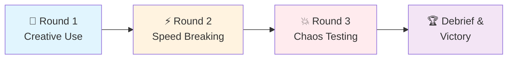
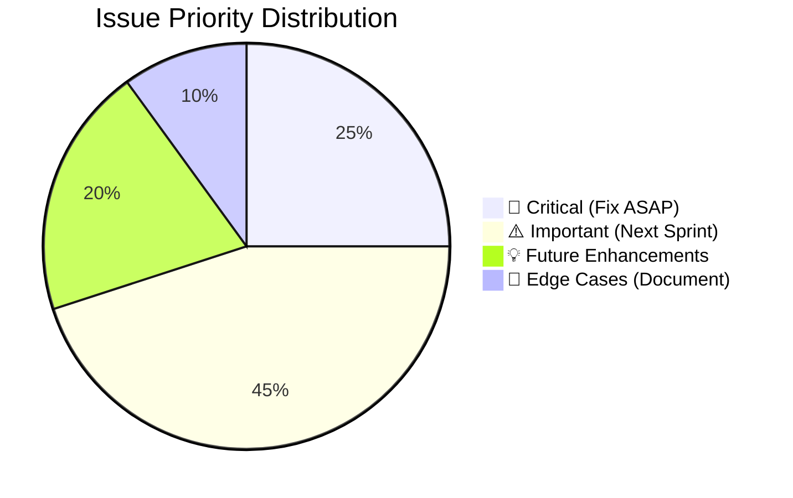

# Issue #39: 🏗Wreck it, Wralphie Product testing and iteration

**Repository:** `CherrelleTucker/codesign-toolkit`
**URL:** https://github.com/CherrelleTucker/codesign-toolkit/issues/39
**Author:** @CherrelleTucker
**State:** `open`
**Labels:** 👥 users-stakeholders, ⚙️ technical-codev, 🎯 difficulty-advanced
**Assignees:** None
**Created:** 2025-11-16T01:53:53Z
**Updated:** 2025-11-16T16:50:44Z

---

# 🔥 Break It Challenge Activity 💥  

> **⚡ Competitive Product Testing**: Teams race to discover issues through structured "breaking" attempts  
> **🎯 Goal**: Find bugs faster than your competitors while having a blast doing it!

---

## 📋 Quick Setup

| 🕐 **Duration** | 👥 **Participants** | 🛠️ **Materials** | ⚙️ **Prerequisites** |
|:---:|:---:|:---:|:---:|
| 60-75 min | 6-12 people<br/>(teams of 2-3) | Product access, scenario cards,<br/>timers, scoreboard | Core functionality<br/>working |

---

## 🎮 Game Rounds



---

## 🎯 Round 1: Creative Use Cases
**⏱️ 15 minutes | 🎪 Fun Exploration Mode**

<details>
<summary>🃏 <strong>Scenario Card Deck</strong></summary>

### 🎭 Draw Your Challenge:

| Card | Challenge | Difficulty |
|:---:|:---|:---:|
| 🤹 | **Multitask Master**: Use product while juggling 3 other work tasks | ⭐⭐ |
| 🏃 | **Speed Demon**: Complete workflows at maximum human speed | ⭐⭐⭐ |
| 📱 | **Mobile Warrior**: Mobile-only testing while walking around | ⭐⭐ |
| 🎤 | **Accessibility Hero**: Keyboard/voice commands only | ⭐⭐⭐ |
| 📞 | **Distraction Central**: Use during active video call | ⭐⭐ |
| 🐌 | **Poor Connection**: Simulate terrible internet | ⭐⭐⭐ |
| 🔧 | **Creative Repurpose**: Solve unintended problems | ⭐⭐⭐⭐ |

</details>

<details>
<summary>🏅 <strong>Scoring System</strong></summary>

```
🎯 Valid Use Case Discovery      → +2 points
🔍 Usability Issue Found         → +3 points  
💡 New Feature Opportunity       → +5 points
🛠️ Improvement Suggestion        → +1 point
🎨 Most Creative Approach        → +3 bonus points
```

</details>

---

## ⚡ Round 2: Speed Breaking
**⏱️ 20 minutes | 🏁 Competitive Racing Mode**

### 🏃‍♂️ Phase A: Rapid Fire Testing (8 min)
> **Mission**: Complete identical tasks faster than other teams while documenting friction

### 🎯 Phase B: Edge Case Olympics (12 min)

<details>
<summary>🏟️ <strong>Testing Stations Championship</strong></summary>

#### 🗃️ **Data Limits Station**
```bash
Challenge: Push data boundaries to the limit
✅ Massive datasets        ✅ Special characters (émojis! 🦄)  
✅ Empty field testing     ✅ Boundary conditions (max/min)
```

#### 🔄 **Workflow Boundaries Station**  
```bash
Challenge: Break the intended user journey
✅ Wrong order actions     ✅ Skip required steps
✅ Restricted area access  ✅ Backwards navigation
```

#### 🔗 **Integration Thunder Dome**
```bash
Challenge: Test connections with other systems
✅ Import/export chaos     ✅ Browser compatibility  
✅ Third-party tools       ✅ API stress testing
```

</details>

<details>
<summary>🏆 <strong>Speed Round Scoring</strong></summary>

| Achievement | Points | Bonus Conditions |
|:---|:---:|:---|
| 🔍 Minor usability issue | 1pt | +1 if found first |
| ⚠️ Major workflow problem | 3pts | +2 if reproducible |
| 💥 System/integration issue | 5pts | +3 if affects multiple areas |
| 🏃 Speed completion bonus | 2pts | Fastest team only |

</details>

---

## 💥 Round 3: Chaos Testing 
**⏱️ 20 minutes | 🌪️ Advanced Destruction Mode**

> ⚠️ **WARNING**: Only for products ready to handle some chaos!

<details>
<summary>🌪️ <strong>Chaos Stations Tour</strong></summary>

### 🎲 **Station Rotation** (5 min each)

```ascii
    📊 DATA CHAOS           👥 USER CHAOS
    ┌─────────────────┐    ┌─────────────────┐
    │ • Massive files │    │ • Multi-user   │
    │ • Special chars │    │ • Button mash   │  
    │ • Empty forms   │    │ • Conflicts     │
    │ • Duplicates    │    │ • Back button   │
    └─────────────────┘    └─────────────────┘
            │                        │
            └────────┬─────────────────┘
                     │
    🌐 NETWORK CHAOS         💻 DEVICE CHAOS
    ┌─────────────────┐    ┌─────────────────┐
    │ • Drops mid-task│    │ • Screen sizes  │
    │ • Slow speeds   │    │ • Zoom levels   │
    │ • Offline mode  │    │ • OS differences│
    │ • Refreshes     │    │ • Mobile/desktop│
    └─────────────────┘    └─────────────────┘
```

</details>

<details>
<summary>💯 <strong>Chaos Scoring Matrix</strong></summary>

| 🎯 Discovery Type | Base Points | 🚨 Multipliers |
|:---|:---:|:---|
| System crash/error | 10pts | x2 if affects data |
| Data loss issue | 15pts | x3 if permanent |
| Security concern | 20pts | x5 if critical |
| Performance degradation | 5pts | x2 if measurable |

**🏆 Special Achievements:**
- 🔥 **Chaos Master**: Most issues in chaos round (+10pts)
- 🛡️ **Guardian**: Finds security issue (+15pts)  
- 🎯 **Sniper**: Most precise bug reports (+5pts)

</details>

---

## 🏆 Victory Ceremony & Battle Analysis
**⏱️ 15 minutes | 📊 Results & Action Planning**

<details>
<summary>📣 <strong>Champion Showcase</strong> (10 min)</summary>

### 🥇 **Team Power-Ups Presentation**
Each team presents their **Top 3 Legendary Discoveries**:

```
🤯 MOST SURPRISING ISSUE
   └─ "We never saw this coming..."

💥 HIGHEST IMPACT PROBLEM  
   └─ "This would destroy user experience..."

🛠️ EASIEST VICTORY
   └─ "Quick fix, big improvement..."
```

### 🗳️ **Community Voting Categories**:
- 🏆 **Most Creative Breaking Attempt**
- 🎯 **Best Bug Hunt Technique**  
- 💡 **Most Constructive Feedback**
- 🤝 **Best Team Collaboration**

</details>

<details>
<summary>⚡ <strong>Action Battle Plan</strong> (5 min)</summary>

### 🎯 **Issue Triage Tournament**
Group votes to classify discoveries:



### 📋 **Victory Action Card Template**:
```yaml
Issue: [Epic Bug Description]
Severity: 🚨Critical | ⚠️Important | 💡Future  
Reproducer: [Step-by-step recreation guide]
Champion: [Hero who will tackle this]
Timeline: [Quest completion date]
```

</details>

---

## 🎚️ Difficulty Selector

<details>
<summary>🎮 <strong>Choose Your Adventure Level</strong></summary>

### 🌱 **Beginner Mode** (Early Stage Products)
```diff
+ Round 1 Only: Creative Use Cases
+ Focus: Usability & workflow discovery
+ Tone: Constructive exploration
- Skip: Chaos testing
- Skip: Competitive breaking
```

### ⚡ **Intermediate Mode** (Beta Products)  
```diff  
+ Rounds 1-2: Creative + Speed Breaking
+ Light Chaos: Data & workflow stations only
+ Balance: Issue finding + solution thinking
~ Moderate competition level
```

### 🔥 **Expert Mode** (Mature Products)
```diff
+ All Rounds: Full chaos unleashed
+ Advanced: Custom chaos scenarios
+ Focus: System limits, security, performance  
+ Maximum: Competitive intensity
```

</details>

---

## 🎒 Mission Equipment Checklist

<details>
<summary>✅ <strong>Pre-Flight Checklist</strong></summary>

### 🛠️ **Technical Arsenal**:
- [ ] 📱 Product access/accounts for all teams
- [ ] 🃏 Scenario cards (shuffled & ready)
- [ ] ⏱️ Visible countdown timers
- [ ] 📊 Digital scoreboard/leaderboard
- [ ] 💾 Test datasets (various sizes)
- [ ] 💻 Multiple devices/browsers available

### 🎪 **Engagement Tools**:
- [ ] 🏆 Victory celebration materials
- [ ] 📸 Photo props for winners
- [ ] 🍕 Snacks for energy maintenance
- [ ] 🎵 Optional: Energetic background music
- [ ] 🎁 Small prizes for achievements

</details>

---

## 📈 Success Metrics Dashboard

<details>
<summary>📊 <strong>Victory Conditions Tracker</strong></summary>

### ⚡ **Immediate Battle Stats**:
```
🎯 Issue Discovery Rate     → Unique valid issues found
📐 Coverage Breadth         → Different issue categories hit  
🔥 Team Engagement Level    → Energy & participation score
🎪 Fun Factor Rating        → Post-activity team feedback
```

### 🚀 **Long-term Campaign Results**:
```  
🔧 Resolution Rate          → Issues fixed within 2 weeks
📈 Impact Assessment        → UX improvements measured
🔄 Process Integration      → Testing practice changes
😊 Stakeholder Satisfaction → Developer/PO happiness score
```

</details>

---

<div align="center">

### 🎉 Ready to Break Some Stuff? 

**Remember**: *The goal is productive discovery, not destructive chaos!*  
**Celebrate** both successful bug hunting AND creative solution thinking! 🎯

---

```
⚡ Let the Breaking Begin! ⚡
```

</div>
