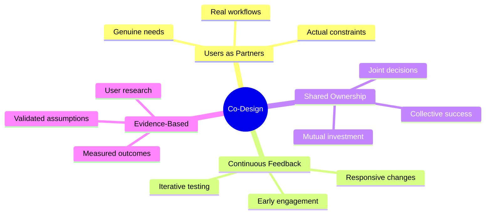

# 🗺️ Co-Design Framework Overview
## *Understanding the Philosophy and Process*

---

> **Core Philosophy**: *Solutions co-created with users, not built for them, become more usable, accessible, and impactful.*

---

## 🤔 What Is Co-Design, Really?

### 🎯 **Definition from NASA's NSITE Program**

> *"User-Centered Design (UCD) is a collaborative approach to product and solution development in which the developer works together with the end user to formulate solutions and implementation plans. Co-design fosters an environment in which agencies can participate in the solution space, providing insight into workflows and the decision-making process to the implementation teams during stakeholder or user 'touch points.' The co-design process ensures that solutions will be usable, accessible, and actionable upon completion."*
>
> **Source**: *NSITE Solution Project Plan Template*

---

## 🔄 The Co-Design Process Cycle

```mermaid
graph LR
    A[🔍 Understand] --> B[📋 Define]
    B --> C[🎨 Design]
    C --> D[🧪 Test]
    D --> E[⚙️ Refine]
    E --> F[🚀 Deploy]
    F --> A
    
    style A fill:#e3f2fd,stroke:#1976d2
    style B fill:#e8f5e9,stroke:#388e3c
    style C fill:#fff3e0,stroke:#f57c00
    style D fill:#fce4ec,stroke:#c2185b
    style E fill:#f3e5f5,stroke:#7b1fa2
    style F fill:#e0f2f1,stroke:#00796b
```

<table>
<tr>
<td width="40%">

</td>
<td width="60%">

### 🎯 **Key Insight**
This isn't a linear process! You'll cycle through these stages multiple times, refining and improving your solution based on continuous user engagement and feedback.

**Each cycle teaches you:**
- What users actually need (vs. what you thought)
- How they really work (vs. how you assumed)
- What barriers exist (that you didn't know about)
- Which solutions stick (and which don't)

</td>
</tr>
</table>

---

## 🌟 Six Core Principles

<strong>🯠1. User Focus: Design WITH Users, Not FOR Them</strong>

### What This Means:
- Users are partners, not recipients
- Their expertise in their own workflows is invaluable
- Engagement happens throughout development, not just at the end

### In Practice:
- Start conversations before you start coding
- Regular check-ins during development
- Users help define success criteria

> **Source**: *NSITE Solution Project Requirements and Expectations*

<strong>🔄 2. Iterative Design: Build, Test, Learn, Refine</strong>

### What This Means:
- Small improvements based on real feedback
- Fail fast, learn quickly
- Each iteration is informed by user input

### In Practice:
- Weekly user feedback sessions
- Rapid prototyping and testing
- Documentation of what works (and what doesn't)

> **Source**: *Solution Co-Development Toolkit Narrative*

<strong>🌠3. Context Awareness: Understand the Real World</strong>

### What This Means:
- Technical constraints are just one part of the puzzle
- Institutional, cultural, and workflow contexts matter
- Solutions must fit actual deployment environments

### In Practice:
- Observe users in their actual work settings
- Map information flows and decision-making processes
- Account for organizational constraints and timelines

> **Source**: *SERVIR Service Planning Toolkit 2021*

<strong>✨ 4. Usability First: Make It Work for Real People</strong>

### What This Means:
- Technical functionality ≠ usability
- Accessibility is non-negotiable
- Solutions should feel intuitive, not complicated

### In Practice:
- User testing with actual tasks
- Accessibility reviews and improvements
- Training materials that match user skill levels

> **Source**: *NSITE Solution Project Plan Template*

<strong>🤠5. Collaborative Planning: Foster Shared Investment</strong>

### What This Means:
- Transparent communication builds trust
- Joint decision-making creates ownership
- Success is measured collectively

### In Practice:
- Shared project roadmaps and timelines
- Regular touchpoints with clear agendas
- Documentation of decisions and rationale

> **Source**: *SERVIR Service Design Tool 2021*

<strong>📊 6. Evidence-Based: Ground Decisions in Data</strong>

### What This Means:
- User research trumps assumptions
- Validated feedback drives design choices
- Success is measured and documented

### In Practice:
- Structured needs assessments
- Usability testing with metrics
- Impact stories and adoption tracking

> **Source**: *Solution Co-Development Toolkit Narrative*

---

## 🚀 Ready to Get Started?

### Next Steps:
1. **📋 [Explore Tool Categories](tool-categories.md)** - Find tools for your current phase
2. **🛠️ [Implementation Manual](implementation-manual.md)** - Practical how-to instructions
3. **🤝 [Collaboration Companion](collaboration-companion.md)** - Tips for working with users
4. **📚 [Learning Resources](learning-resources.md)** - Deepen your knowledge

---

**🎯 Remember: The goal isn't perfect tools—it's tools that work perfectly for your users.**

[← Back to Main](README.md) | [Next: Tool Categories →](tool-categories.md)

